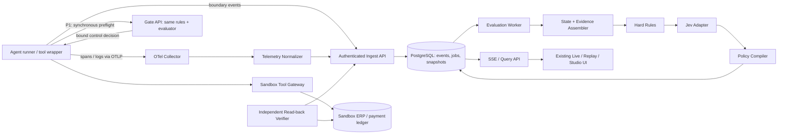

# Silex：Jev 实时 Agent Observability 真实实现设计

**RFC v0.1 · 2026-09-28 · 状态：待工程评审，不是已实现系统**  
**代码基线：** `silex-security/silex-mockup@fbd598dca17fc67299ccf96a128af65701b7b81a`，范围 `jev-observability/`。  
**定位：** 保留现有交互，将浏览器模拟器演进为由真实运行事件、真实 Jev 判断与独立结果证据驱动的 runtime semantic observability POC。

## 0. 结论与范围

推荐先完成 **Live Sandbox + Shadow Monitoring**，再加 **Sandbox Gate**。不是把 `jev-sim.js` 改为一次 HTTP 调用就算完成。

本 POC 必须验证三个假设：

1. 对同一份决策时点的上下文，Jev 能否比优化后的结构化 LLM judge 更快地产生有用语义信号？
2. 在规则检测之外，Jev 能否增加可复核的异常发现，而不是给规则已有结论增加一组分数？
3. UI 能否真实关联“提出操作 → 风险信号 → 控制响应 → 实际执行 → 业务结果”，且证据不足时明确显示 unknown？

**P0 包含：** 现有 AP / Procurement 场景、一个真实 Agent runner、实际执行的沙盒工具、边界事件采集、服务端 Jev、规则引擎、持久化、SSE、Policy Replay、业务结果读回及对照评测。

**P1 包含：** 仅在沙盒对 payment/email 工具启用前置 gate；OTel 输入的额外语义适配；策略发布和审批；结构化安全事件导出。

**不在本轮：** 真实资金转移、真实外部邮件、任意互联网工具访问、全企业 ontology/graph、自动生成并上线策略、全框架覆盖、自建 Jev 权重训练、以“符合 ACS/OCSF”作为未测试的宣传。既有主站不需要重写，现有静态 demo 继续可用。

### 0.1 本次核查的边界

已阅读该目录的 README、CONTRACT、engine 的 types/state/router/policy/kpi，以及 UI app/replay 和仓库既有设计计划。[R1–R9] 线上 Vercel URL 在本次环境抓取失败；因此以下现状判断基于固定 commit 的源码，不代表已经完成部署页面的浏览器验收。未调用付费 Jev API，未运行该项目测试，未修改远程仓库。本文所有延迟、吞吐和质量门槛均为拟议验收目标，不是测量结果。

---

## 1. 现有实现：保留什么，重写什么

现有子目录是零依赖的浏览器 ES modules 演示，决策、延迟、概率及成本由模拟器生成；README 已正确披露。[R1]

| 当前文件 / 行为 | 保留资产 | 真实实现要求 |
|---|---|---|
| `index.html`、`css/app.css`、`js/ui/*` | Live / Replay / Policy Studio / About、Inspector、视觉与 DOM hooks | 新增数据源 adapter；live 模式只呈现服务端记录，不运行本地判断 |
| `js/engine/scenarios.js`、`rng.js` | 可重现样本与 deterministic 回归用例 | 限于 demo/test；live scenario 按钮启动后端沙盒任务，不直接制造 verdict |
| `js/engine/types.js` | 边界、决策枚举、envelope 思路 | versioned runtime schema；区分 evaluation / control / execution / outcome |
| `js/engine/state.js` | 状态构建、证据引用、数据最小化思路 | 重写为有来源、时点、版本、缺失标记的 snapshot assembler |
| `js/engine/rules.js` | code-first hard veto | 迁到服务端；证据须来自权威连接器，不信任 agent 自报 approval/status |
| `js/engine/jev-sim.js` | 假模型故障注入与回归测试 | 新增服务器 `JevClient`；模拟器不进入 live bundle 的执行路径 |
| `js/engine/policy.js` | 硬规则优先、阈值与 fallback | 严格校验、unknown 状态、有效 calibration 与 mode-aware actions |
| `js/engine/router.js` | 流水线阶段划分 | 从同步纯模拟调用拆成异步评估编排、独立 gate 路径与持久化事件 |
| `js/engine/llm-sim.js` | UI 慢路径呈现 | 真实慢路径可选；不配置则显示 not configured，不能伪造解释 |
| `js/engine/kpi.js` | 日志驱动聚合 | 改用 measured timing、真实调用账本、独立标签、完整 coverage 分母 |
| `js/ui/replay.js` | 阈值敏感性与规则不变量演示 | 拆成 policy-only replay / model re-evaluation / sandbox re-execution |
| `js/engine/siem.js` | 脱敏 JSONL 出口 | P0 为明确标识的 Silex JSONL；后续单独做 OCSF 版本映射与校验 |

### 1.1 必须先解决的具体问题

**状态缺少语义依据。** 当前 `safeView` 主要包含 tool、argument keys、features、脱敏后的短 sources；不包含清晰任务目标、候选输出全文或 invoice/account holder 的直接比较上下文。把此对象直接发给 Jev，容易让模型重复已有 heuristic，而不是独立读懂行为。[R4]

**不能把模拟特征当模型解释。** `features_used` 在模拟器中是实际输入来源；真实 Jev 并不返回这些 attribution。真实 UI 应改为 `evidence_supplied` / `state_fields_supplied`。只有规则引擎能明确证明它检查了什么；模型接收某条证据，不等于它确实据此作出决定。[R4,R10]

**confidence 不兼容。** 旧 contract 用 `max(p,1-p)` 和 top1 probability 模拟 confidence。真实 Noul 只有 `noul`；Choice/Score 的 confidence 是供应商从分布计算的统计量，不等同于 top1 probability。旧阈值必须重新标定。[R2,R11]

**同步调用不能靠减去 latency 变成异步。** 旧 `route()` 总是先调用 Jev，再按 `jev_on_critical_path` 计算模拟耗时。真实 hard-rule veto 应立即返回，Jev 可跳过，或作为不影响决策的异步诊断调用。[R3]

**低 confidence 的后台解释不等于保护。** 旧 `combine()` 的 escalation 永远不改变已经选定的 decision。对高影响 gate，必要语义信号不可用或不确定时必须先 HOLD，再调查；不能先 ALLOW 再等待解释。[R5]

**impact 当前未参与强制决策。** `impact` 在 battery 中被收集，但当前 `combine()` 没有相应 Score 分支。真实版将语义 impact 限于分诊优先级；最低风险等级来自服务端 tool registry，模型不得把 payment 降为低风险。[R5,R6]

**coverage 存在自证问题。** 当前分母是已有的 pre_tool envelopes，因此无法发现完全未采集的工具调用。真实分母必须来自 runner/tool gateway 的 attempted-call 计数。[R7]

**Replay 会重跑整个 route。** 旧 sweep 因模拟器可重现而成立。换成真实模型后不能对每个阈值再次调用 Jev；既浪费费用，也混入模型波动。[R8]

---

## 2. 运行模式与不可破坏的边界

| 模式 | telemetry | Jev | 工具 | 执行约束 | UI 必须显示 |
|---|---|---|---|---|---|
| `demo` | fixture | simulator | simulated | 无真实控制 | Simulated |
| `live_sandbox_shadow` | 真实采集 | 真实 API | 隔离沙盒内真实执行 | Jev 仅提出建议；工具本身基础授权一直启用 | Live Jev · Sandbox tools · Shadow |
| `live_sandbox_gate` | 真实采集 | 真实 API | 隔离沙盒内真实执行 | 认证后的 preflight 决定是否允许该操作 | Live Jev · Sandbox tools · Enforced |
| `customer_shadow`，后续 | 客户授权接入 | 按数据处理授权 | 客户系统 | 不因 POC 绕过客户 IAM / 网关 | Customer telemetry · Shadow |

`source_mode`、`judge_source`、`tool_environment`、`enforcement_mode` 四个维度分开存储。仅有 `simulated:false` 不能说明业务数据真实、Jev 已调用或工具已执行。

强制不变量：

- Jev 不是授权机构；它不能生成 approval、扩展权限或覆写硬规则。
- `pre_tool` 的异步告警不声称已阻断；只有执行端确认 `not_executed` 才显示 prevented。
- 缺少证据 ≠ 没有风险；模型故障 ≠ 低风险；`HTTP 200` ≠ 业务完成。
- Shadow 只关闭新增语义控制，不关闭工具既有的身份、额度、审批和幂等检查。
- 所有真实策略、rubric、模型、snapshot、calibration 都有版本；改变后不修改历史结论。
- 不采集或依赖隐藏 chain-of-thought；使用可观测的指令、动作、工具 I/O 与业务结果。

---

## 3. 最小可实施架构

为了保持 POC 可控，采用 **现有 Vanilla JS UI + TypeScript 后端 + PostgreSQL + OTel Collector + 沙盒 runner**。Jev adapter 可直接使用 HTTP API，或固定版本的官方 JS SDK；不要在浏览器保存 key。官方已有 Node.js JS/TS SDK。[R12]

P0 后端只部署一个副本：API、SSE 和受监督的异步 worker 可在同一进程内，以共享 limiter 控制 Jev 预算；任务持久化在 PostgreSQL，重启后能恢复。不宣称 HA。达到负载或隔离需求后再拆 API/worker，并引入跨实例 rate limiter。不先引入 Kafka、图数据库或 ClickHouse。



### 3.1 两条不同的通路

**观测通路：** 生命周期事件被接受并持久化 → 组装 snapshot → 规则/模型评估 → 发布 signal → SSE 刷新。Agent 不等待语义评估。普通 span 可走 OTLP；即时生命周期事件直接走 capture API，避免把批量导出等待计入模型延迟。

**控制通路：** tool wrapper 在 side effect 前调用 `/v1/preflight` → 同步取得绑定参数的决定 → 验证授权和 freshness → 执行或拒绝 → 写执行回执。此路径不排普通观测任务队列，也不等待完整 trace 结束。

OTel 的常规 simple/batch span processors 导出已结束的 span；在长 span 上先记录 `pre_tool` event，并不能保证消费者在执行前看到它。单纯缩短 batch interval 也不能把 tracing 变成执行控制。[R13]

### 3.2 客户端仅呈现，服务器作决定

公开 Vercel 页面继续提供 demo。真实模式由受保护的后端提供 session、数据与 policy API。生产策略不存于浏览器内存或 localStorage；浏览器修改只产生 draft。SSE 长连接和 worker 生命周期由后端服务管理，而不是依赖某次页面请求存活。

---

## 4. 真实 Agent 与沙盒工具

第一条真实 workflow 保留 AP / Procurement：读取 PO → 查询 vendor → 判断付款需求 → 提出工具调用 → 查询 posting → 返回处理结果。

| 工具 | 真实实现 | 独立证据 |
|---|---|---|
| `erp.get_po` | 查询沙盒 PO 表 | versioned PO record |
| `vendor.lookup` | 查询独立 vendor/account registry | verified entity/account linkage |
| `payments.execute` | 写沙盒 ledger；支持成功、拒绝、延迟提交等测试状态 | ledger transaction ID + status |
| `email.send` | 写 mail sink，禁止真实外发 | mail sink receipt / recipient / payload digest |
| `erp.payment_status` | 根据 operation ID 查询 ledger | posted / pending / failed 等权威状态 |

两种 driver 分开：`scripted_driver` 用固定操作序列验证管道和故障；`llm_agent_driver` 真正调用生成模型来决定工具操作。两者都能产生真实 telemetry、调用真实 Jev、访问真实沙盒数据库，但 UI 必须显示 driver 类型。

Agent 不持有可绕开 gateway 的工具凭证。沙盒 egress 默认禁止，只允许明确配置的模型服务；工具参数不能指定任意外部地址。每次 run 使用独立 namespace / run ID，防止并发演示污染状态。重放不得重用原业务操作的幂等键。

---

## 5. 数据契约与状态构建

### 5.1 四类记录，不混成一个“可信分数”

| 记录 | 含义 | 关键关联 |
|---|---|---|
| `BoundaryEvent` | 实际观察到了什么 | event/run/trace/span/tool_call、producer sequence |
| `EvaluationRecord` | 给定证据时，模型和规则判断了什么 | snapshot、rubric、model、calibration、policy |
| `ControlDecision` | gate 要求执行端做什么 | operation/args digest、授权版本、有效期、nonce |
| `ExecutionReceipt` + `OutcomeObservation` | 是否执行，以及业务结果 | decision ID、operation ID、resource version、read-back |

建议 schema 草案见 `contracts.ts`。该文件是工程设计契约，不是 vendor API 的替代定义，也不构成已实现的校验器。

### 5.2 BoundaryEvent

四个既有边界继续使用：`pre_input`、`post_generation`、`pre_tool`、`post_tool`；补充 `outcome_observed` 与 run lifecycle 事件。

必需字段：`schema_version`、独立 `event_id`、`run_id`、`trace_id`、可选 `span_id`、`producer_id`、`producer_seq`、`boundary`、`occurred_at`、服务端 `received_at`、`tool_call_id`、主体引用、操作摘要与证据引用。`tenant_id` 从认证凭证推导，不能信任请求体覆盖。

一个 span 可能产生多个边界事件；不能继续使用 `event_id = span_id`。采集器重复上报与 OTLP 镜像使用同一 `source_event_id` 关联，不能重复计数或重复评估。

### 5.3 DecisionSnapshot

每次评估冻结 snapshot，不把“最新的全量 history”直接传给模型。内容包括：

- 经过认证的任务目标和用户意图；系统政策与用户任务分开。
- 当前候选动作、必要参数、tool registry 的影响等级。
- 与该动作有关的少量历史事件，显式标注 pending 和失败。
- 必要的 invoice/vendor/account 等文本及已验证关系；不带原始账户号码。
- 待评估的 draft/claim 原文，以及相关 evidence excerpts。
- 来源的采集主体、真实性状态、指令权限、时间、版本、摘要与 excerpt offset。
- required evidence 清单、缺失项、过期项、截断情况及决策时点 cutoff。

`trusted_source` 不等于“其中的自然语言有权修改政策”。例如工具结果来自真实服务器，仍可能包含用户上传的恶意文本。真实性和指令权限要分开标记，且标签由连接器设置，不能由文本自己声称。

### 5.4 三种数据视图

**Restricted evidence view：** 客户边界内的原始或受限记录；POC 先使用合成业务数据。加密、访问控制、保留时间与删除策略独立配置。

**Jev view：** 仅包含本次问题需要的最小上下文。默认 2–4k input tokens 作为 POC 预算，按问题筛选，不把完整 trace 拼进 prompt；超预算时标记不足，不静默删掉决定安全的关键字段。

**UI / SIEM view：** 进一步隐藏隐私和密钥；点击证据需独立权限，不能因为有 trace read 权限就得到全部银行或身份字段。

不能沿用“把所有数字都替换掉”的粗粒度 redaction：它会破坏时序、实体和操作关系。精确金额/时间判断由代码完成，再把必要的布尔事实或等级交给模型；实体需要比较时保留获准发送的名称/别名，否则明确 `insufficient_evidence`。不能把双方都替换成同一个占位符后声称是同一个收款方。

### 5.5 时点、迟到和重复

按 `(tenant_id, run_id)` 做状态序列化；`producer_seq` 只保证该 producer 内的顺序，不伪造跨 agent 全局顺序。并行分支依赖显式 call ID、parent/span links 与版本引用关联。

评估只使用当时已观察到且被选入 snapshot 的证据。晚到事件追加新的评估 revision，不覆写旧记录；历史 pre_tool 不能借用 post_tool read-back 获得“预知未来”的准确率。状态缺口允许发布 provisional signal，但必要证据不齐的高影响 gate 必须 HOLD。

---

## 6. Jev 集成设计

### 6.1 已核查的真实接口

官方 API：`POST https://api.typesafe.ai/v1/systemone`；请求是 `model + state + questions`；认证用 Bearer key。当前官方版本可固定 `jev-1.13.0`，不要用会移动的 `jev-latest` 做冻结阈值实验。[R10,R14]

官方文档支持 Noul、Choice、Score，同一请求的多个问题针对同一 state 并行求值。**独立求值不等于统计独立**，不能将多个概率相乘后宣传组合置信度。[R15]

截至核查日，模型页列出 1,200 requests/minute、250,000 tokens/second；64k 总请求预算与 state+最长 question 32k 限制，并提示配额可能动态变化。上线前重新确认实际账户额度，单独记录 429 与 529。[R14]

### 6.2 问题库：只把语义问题交给 Jev

完整候选问题见 `jev-questions.v1.json`；调度器根据 boundary 和 evidence applicability 选择子集，通常一事件一次请求，不跨租户合并。

| Question ID | 类型 | 适用边界 | 真正判断什么 | 不能声称 |
|---|---|---|---|---|
| `instruction_override` | Noul | input / pre_tool | 低权限内容是否企图改变上层指令 | 所有 injection 都已阻断 |
| `goal_deviation` | Noul | pre_tool | 当前动作是否偏离认证的任务目标 | 权限已验证 |
| `sensitive_data_transfer` | Noul | pre_tool | 即将转移的内容是否语义上包含受保护信息 | DLP/授权检查已经完整 |
| `payee_relation` | Choice | payment pre_tool | 文本与已验证关系支持同一主体、不同主体，还是不足 | 名称相似即可认定银行账户所有权 |
| `claim_support` | Choice | post_generation | 具体 claim 被证据支持、矛盾，还是不足 | 与真实世界完全一致 |
| `claim_asserts_completion` | Noul | post_generation | 输出是否声称操作已完成 | 操作确实已完成 |
| `semantic_impact` | Score，可选 | pre_tool | 从业务语义判断影响等级以排序处理 | 可以降低 tool registry 的风险底线 |

`intervene` 过于宽泛，替换为具体 semantic question；重复失败、超时、循环计数由代码处理。`attack` 不再强迫 injection / exfiltration 互斥，相关信号可同时为真。`insufficient_evidence` 是显式 option/状态，不靠低 confidence 代替。

金额超限、审批状态、scope、域名规则、TTL、失败次数、幂等和 authoritative outcome 不让 Jev 做。TypeSafe 自己也提醒数学、时间比较、长无关上下文与 adversarial state 是应重点规避的边界。[R16]

### 6.3 真实返回到内部 Signal 的映射

- Noul：`answer.noul → raw_probability`；`vendor_confidence = null`。可另存二元 margin，但明确是本地派生统计量。
- Choice：保留 `choice`、完整 `probabilities`、原始 `confidence`；另外算 top1/top2 margin。
- Score：保留 `score`、`legend`、完整分布和 confidence；不能误把它当任意 0–100 风险分。
- `p_calibrated` 只有对应 model/rubric/state-extractor 的 calibration 生效时才能填写，未标定为 null。
- 不返回自由文本解释。同步说明由代码模板生成；可选慢 LLM 说明标记为 interpretation，而不是 Jev 的推理过程。[R10,R11]

### 6.4 适配器校验与运行约束

服务端必须校验：HTTP 状态、body 上限、JSON 格式、实际模型版本、required question IDs、type、finite range、Choice 的 expected option set、分布和、Score level/legend/score 范围，以及 usage。required answer 缺失/损坏不能填成 0 risk。Usage 缺失影响账单状态，不可冒充免费调用；不应仅因可选 billing metadata 缺失把一个可验证的语义答案伪装成模型没有回答。

保存 `evaluation_id`、client request ID、供应商 request ID（仅响应确实提供时）、request hash、selected question set、实际 model、rubric、snapshot、HTTP duration、attempt count、usage 和 status。response `model` 不等于固定配置时进入 version-mismatch，不复用旧标定。

Jev key 只在后端 secret store；禁止传入 UI、querystring、SSE、原始日志或 export。输入文本不允许修改 questions、policy 或 API destination。

### 6.5 Deadline、重试、降级

P0 用可配置 10 requests/second 总限额作为初始测量档位，给当前公布的额度留余量；按 token 与 request 两个维度限制。它是本系统配置，不是 vendor 保证。

**Shadow：** 任务有 lease 与有效期，429/529 可按 header/backoff 重试，但不能无限积压。过期任务发 `evaluation.expired`；后续离线评估标为 late，不计入实时覆盖。最近事件不能被大量 replay 挤占。

**Gate：** 总预算起始设为 600ms，Jev attempt 上限设为 400ms，并扣除已用时间与提交决定的余量。默认不使用 SDK 的隐式长重试；一个 timeout 后立即采用风险相关 fallback。未完成的 HTTP 调用即使客户端 abort，也可能已在服务端执行或计费，记录 billing unknown。

**硬规则已决定：** 立即返回，不等待 Jev。可选诊断评估用独立队列、低优先级和明确调用来源，不计算进 gate latency。

**降级不偷删必要问题：** 高影响工具的 required questions 不得因 RTT spike 被静默移除。非必需 enrichment 可跳过，并发布 `coverage_gap`；required signal 不可用则 high-impact HOLD/deny-to-execute，低影响只在基础授权通过后继续并告警。

---

## 7. 决策引擎：风险结论与动作分离

服务器 policy compiler 使用 immutable rules / semantic calibration / per-tool mode。输出解释必须能还原到规则 ID、阈值、snapshot 与信号；任何网页字段都不是授权来源。

建议决策顺序：

```text
1. 认证、tenant 隔离、tool scope、参数 schema / 幂等检查失败 -> 拒绝
2. 权威硬规则 violation -> BLOCK / STOP；不能被模型覆盖
3. 必需证据缺失、过期或未验证 -> HOLD / UNKNOWN
4. required Jev 信号不可用或标定不适用 -> 根据 impact 降级，不判安全
5. 已标定语义信号命中 intervention band -> 建议 REVIEW / sandbox HOLD
6. 其余 -> 未发现已配置风险；不是“安全已证明”
```

P0 的语义策略默认 shadow，阈值未标定时只显示原始分数与实验性建议，不默认接上自动 BLOCK。`policy-v1` 的原模拟阈值不能拿来直接开启真实付款控制。

对于 P1 high-impact Gate，`REVIEW` 在执行层映射为 `hold_for_review`，没有明确批准不能继续。完成 review 后创建新的控制决定，并重新检查资源版本、授权、参数 hash 与 expiry。慢 judge 的晚到回答不得覆写已经执行的历史，也不能自行产生批准。

Monitor 下记录 `would_have`；`enforced_action = null`。普通已完成的 post_tool/post_generation finding 不能再使用 `allow/deny` 暗示改变过去，只能 alert、开调查任务或控制后续操作。P0 不实现模型生成的参数 modify；需要修改时由 Agent 重新提出动作并重新评估。

### 7.1 Gate 防止“检查 A，执行 B”

`ControlDecision` 必须绑定 tenant、run、主体、tool、operation ID、完整参数的 canonical digest、授权/策略/snapshot 版本、有效期与 nonce。执行端从认证信道取回或验证签名，不接受浏览器上传的伪造决定。

执行前重新验证参数未变、许可未撤销、资源版本仍适用；必须由真正持有 side-effect 凭证的 gateway 执行。必要时在事务里检查并执行，不能只检查时间戳。写操作携带业务幂等键；因 HTTP timeout 不得盲目重试付款。授权撤销与重试冲突都必须有测试。

---

## 8. 独立 Outcome Verifier

旧 `span.readback.posted` 来自样例对象，真实版不能让 Agent 把它作为事实提交。[R4] 独立 verifier 使用只读凭证查询 ERP / ledger / mail sink，按 operation ID 关联，并验证 tenant、payee、amount、resource version 等必要关系。

状态机：

```text
not_observed -> pending -> verified_success
                       -> verified_failure
                       -> mismatch
                       -> unknown_after_deadline
```

首次读取尚未 posted 可能只是最终一致性，不直接等于失败。使用业务配置的 read-back deadline 与 bounded backoff；在未到 deadline 时显示 pending。如果明确返回 failed 或发现 payee/amount 不一致，则立即发相应 finding。deadline 到期仍无权威答案标记 unknown，而不是凭模型相信成功。

若 Agent 声称“已完成”，Jev 只识别该完成主张；代码比较是否存在匹配且可信的 success record。成功事实来自业务系统，不来自 Jev，也不来自工具 HTTP code。

Outcome 以追加事件到来；可以更新当前 UI projection，但原先的 preflight snapshot 与 decision 保持不变。

---

## 9. 持久化、可靠性与 API

### 9.1 PostgreSQL 最小表

`runs`、`events`、`evidence_refs`、`snapshots`、`evaluation_jobs`、`evaluations`、`signals`、`policy_versions`、`control_decisions`、`execution_receipts`、`outcomes`、`review_tasks`、`outbox`、`audit_log`、`labels`。

Events 接受后与 job 创建同事务提交，API 再回 202。Consumer 使用 lease，失败可恢复。幂等键建议 `(tenant, event_id)`；评估键包括 snapshot/rubric/model/policy/evaluation_kind。重复事件内容不一致时不能覆盖，返回 conflict 并审计。逻辑记录做到去重，但网络失败下的模型请求仍可能重复收费，不宣称 exactly-once inference。

SSE 基于持久化 outbox cursor，支持断线续传和分页补齐，不单靠进程内 pubsub。worker crash、SSE reconnect、duplicate delivery 不应使 UI 重复行或丢掉审计记录。浏览器可限制活动列表长度，但服务端记录不能随 UI pruning 删除。

### 9.2 对外接口

| 接口 | 用途 | 模式 / 约束 |
|---|---|---|
| `POST /v1/events` | 接收边界事件 | service auth；tenant 从凭证派生；持久化后 202 |
| `POST /v1/preflight` | 请求执行前控制决定 | P1；强认证；短 deadline；不经常规队列 |
| `POST /v1/execution-receipts` | 工具执行端回执 | 仅 gateway 身份；绑定 decision / operation |
| `GET /v1/runs`、`GET /v1/runs/:id` | 查询运行和时间线 | tenant-scoped RBAC；分页 |
| `GET /v1/evaluations/:id` | 查看 snapshot / raw answer / policy provenance | 内容权限分层 |
| `GET /v1/stream` | SSE events、signals、outcomes | auth；cursor；不能 querystring 放长期 key |
| `POST /v1/replays` | policy-only 或 model-re-evaluation | 显式 kind；调用预算；不能产生业务 side effect |
| `POST /v1/policies/drafts`、`.../:id/publish` | 草案、发布与审计 | editor 与 publisher 权限分离 |
| `POST /v1/reviews/:id/resolve` | 人工审阅 | P1；拒绝客户端直接指定有效 ALLOW |
| `POST /v1/sandbox/runs` | 启动沙盒场景 | 私有环境；rate limit；无任意工具地址 |
| `GET /healthz`、`GET /readyz` | 健康检查 | readiness 区分 DB、配置、judge degraded |

OTLP receiver 保留标准 `/v1/traces` / `/v1/logs` 入口，由 Collector 或经过验证的官方协议库处理。`/v1/events` 中的 Silex BoundaryEvent 不冒充 OTLP JSON；normalize 阶段保留原始语义版本与 instrumentation scope。

---

## 10. UI 改造：四页保留，数据来源升级

### Live

顶部同时标明 event source、judge source、tool environment、enforcement mode。新增 connection lag、queue age、judge timeout、pending outcome 与 evidence gaps。到达事件时先显示 pending；Jev 完成和业务读回是不同阶段，不能等全完成才制造一条“实时”记录。

原 Blocks 分成 `recommended interventions` 与 `confirmed prevented actions`；Shadow 的 would-block 不算 prevented。Live 没有独立标签时，recall / false-block 显示 N/A，不显示 0%。

故障注入只在私有沙盒启用；需模拟实际 HTTP 超时、429、schema error、丢事件和 read-back 延迟，而不是仅改 UI 文本。实时页面的 Pause 只暂停显示/订阅，不暂停 Agent 或停用安全控制；要停止 run 必须单独调用有权限的后端 stop API。

### Inspector

显示：raw boundary、snapshot as-of、证据来源/缺失/截断、hard-rule hits、Jev raw answers、calibration、policy、actual action、receipt、outcome。`features used` 改为 `evidence supplied`；模型不支持 attribution 时不制造解释。duration 各阶段使用 measured，不显示随机数。

### Replay

**Policy-only replay：** 复用原始 snapshot、rule results、Jev answers，仅执行新阈值。零模型调用，快速 sweep。rule veto 不变量保留。

**Model re-evaluation：** 固定历史可见 snapshot，使用新 rubric/model 再调 Jev；产生新的 evaluation ID、账单与版本，可能有不同输出。

**Sandbox re-execution：** 新 run，新状态 namespace、新 operation/幂等键；不能叫作“在原 trace 上重放阈值”。只能在沙盒执行。

Policy-only replay 是历史决策敏感性分析，不是证明新策略会在真实世界减少多少损失的因果实验。

### Policy Studio / About

Studio 流程：draft → validate → offline replay → review → publish immutable version → activate → rollback。所有 activation 含 actor/time/base version；并发修改使用 optimistic version check。rubric 内容可更改时同样触发重新标定，不能沿用旧 calibration。

About 分开呈现供应商公开描述、实测 benchmark、沙盒合成数据、实际客户数据。三路径比较只展示同一数据集和测量协议下的结果；未测 baseline 为 not measured。

---

## 11. 观测指标、性能和费用

### 11.1 指标定义

| 指标 | 起止 / 分母 | 注意事项 |
|---|---|---|
| `ingest_to_signal_ms` | 服务端接收 event → signal 持久化完成 | 包括排队、状态组装、规则、HTTP、校验、写入 |
| `judge_http_rtt_ms` | 客户端发出 Jev HTTP → 完整响应被读取 | 不是 vendor 内部 inference time |
| `sdk_preflight_ms` | SDK 请求 gate → SDK 收到有效控制决定 | P1；包含网络与所有校验；失败响应也报告 |
| `outcome_verification_lag_ms` | 执行回执 → 达到某个 outcome 状态 | pending 和 unknown 单列 |
| `capture_coverage` | 已采集 boundary / gateway 实际 attempted calls | 不能以已有 envelopes 自证分母 |
| `semantic_coverage` | 所需语义判断完整且及时完成 / eligible boundaries | timeout、expired、missing-required 都是缺口 |
| `enforcement_coverage` | 有有效决定且有 receipt 的 gated operations / 应 gate 的 attempted calls | Shadow 为 N/A |
| `false_denial` / `false_intervention` | 独立 benign labels 中被拒绝 / 被 HOLD或REVIEW等干预的比例 | 两者不能混成一个指标 |
| `jev_incremental_recall` | 规则漏掉的 labeled risks 中由 Jev 新增发现的比例 | 分层报告，不能含规则已发现部分 |
| `cost_per_1k_calls`、`cost_per_1k_events`、`cost_per_run` | 明确分母的实际 usage 账本 | 含 shadow/diagnostic/replay/slow-path，不能只算成功 |

生产跨机时间差可能受 clock skew 影响。各进程内 duration 使用 monotonic clock；跨机 event-to-visible 测量须记录时钟校正，或由同一 test harness 测完整链路。不能用两个不同机器未经校正的 `Date.now()` 差值宣传亚秒延迟。

### 11.2 初始验收目标，不是承诺

测试档位：同一部署区域，单后端副本，100 raw events/s，其中通过 eligibility 控制使 Jev 不超过 10 requests/s，典型 state+questions ≤4k tokens。基准输入大小、模型、quota、并发、冷/热连接均写入报告。

- `ingest_to_signal_ms`：p95 ≤500ms，p99 ≤1,000ms；规则-only 与 Jev 路径分别报告，再报告混合结果。
- P1 `sdk_preflight_ms`：p95 ≤500ms；硬 deadline 默认 600ms，Jev attempt 最多 400ms，实际依剩余预算缩短。
- 正常档位的 eligible 实时评估完成比例目标 ≥99%；排除显式注入故障的同时，另报含故障的总完成率。
- 对被 API 确认接受的事件，重启/重连测试中不静默丢失。capture gap 必须可见。
- gate hard-veto 不变量、参数绑定、幂等、跨租户隔离与未授权 policy publish：所有确定性安全测试必须通过。

p95 不满足时先看 queue、snapshot、RTT 与持久化；不能用删除 required evidence 或把超时请求排除掉来“达标”。也不能因为某个平均值低于 500ms 就声称 gate 满足 p95。达不到 gate 预算时继续 shadow，而不是掩盖失败。

### 11.3 费用估算

当前官方列价为每百万 input tokens $0.042，output free。[R14] 假设实际一次请求合计 3,000 billed input tokens：

`3,000 × 0.042 / 1,000,000 = $0.000126 / call`，即 `$0.126 / 1,000 calls`。

这是仅 Jev 模型调用的估算，不包括 agent model、LLM baseline、慢路径、存储和基础设施；也不是每 1,000 个 trace 或每 1,000 个问题的费用。实际以 response usage、账单对账和未知调用的追踪为准。价格记录带有效日期，不硬编码永久价格。

---

## 12. 评测设计：证明 Jev 的增量价值

### 12.1 四个对照组

| 组 | 系统 | 要回答的问题 |
|---|---|---|
| B0 | 相同数据与硬规则，无语义 judge | 纯代码已能解决多少 |
| B1 | 相同硬规则 + 优化后的结构化 LLM judge | 现实的速度/质量基线，不强迫输出长解释 |
| B2 | 相同硬规则 + Jev | Jev 的额外覆盖、时延、费用与 abstention |
| B3 | 相同硬规则 + Jev + 选择性慢路径 | 在升级成本下是否有更好的质量/覆盖 |

B1/B2 使用同样的决策时点 snapshot、数据权限和标签；B1 用短 schema、批量原子判断、复用连接。固定模型版本、请求长度、warm/cold、并发、时间窗口；交错请求避免把网络或供应商负载变化算作模型能力。ground truth 不来自 B1，也不来自 demo 的规则公式。

### 12.2 样本与标签

首轮 300–500 条经过人工复核的独立样本用于发现 rubric/state 问题；后续分 development / calibration / untouched test，按 vendor、document family、attack family、workflow/time 分组切分，不能把同一模板改 seed 后同时放进训练和测试。

准备独立 benign / risk / insufficient-evidence 标签，分别记录 rule catch、semantic label、适当动作和真实 outcome。重要样本由两名 reviewer 独立标注并仲裁；展示分歧率。缺少 gold label 的 Live 流量不计算 accuracy。

晋级 gate 前建议至少独立保留 600 benign 和 200 risk/uncertain 测试案例，且补齐每类风险覆盖；这是候选最低样本规模，不足以证明普适安全。零误拦截的 600 benign 样本，对罕见错误仍只能给出约 3/n≈0.5% 的单侧 95% 上界近似，不能写“错误率为零”。报告真实区间及 sampling assumptions。

阈值按 question、tool impact 和目标代价选择，冻结后才跑 test。评估 PR/recall、false denial、false intervention、abstention、coverage、Brier/ECE 或适用的 calibration 曲线；报 bootstrap/适用置信区间，弱样本不宣布胜出。建议预注册“在同等 false-intervention 上，质量不劣于 B1 的约定容忍区间，且 p95 更低”的晋级规则，不先填一个没有业务依据的通用置信度阈值。

### 12.3 既有场景如何迁移

| 场景 | 真实触发与验收 | Jev 贡献如何计量 |
|---|---|---|
| S1 正常付款 | 沙盒 ledger 真正成功，UI 关联 read-back | benign control，不以 ALLOW 自动当真正确 |
| S2 收款方不匹配 | invoice 与独立 registry 构成 same/different/unknown 样本 | 对比代码名称 heuristic 与 Jev 的 semantic lift；不认定所有权 |
| S3 超额度 | 工具 gateway 硬规则拒绝，ledger 无 side effect | hard-rule success，不算 Jev recall |
| S4 缺审批 | 无有效审批证据，HOLD；模型不能补授权 | evidence-gate success，不算 Jev recall |
| S5 200但未入账 | 有真实 pending / failed / deadline-unknown 变化 | outcome verifier 的正确性，不归功 Jev |
| S6 invoice note 导向外部发送 | mail sink/gateway 实际拒绝非法目的地 | 当前默认由域名规则拦截，不能作为独立 Jev 优势 |
| F1 timeout | 真正延迟或中断 vendor adapter | 高影响停止执行；低影响基础授权后继续并告警 |

新增三个能测语义增量的场景：

**S7 允许的工具、允许的目的地，但用途偏离。** 比如任务只要求查询状态，候选操作却准备发送与任务无关的资料。预先确认规则基线未命中，再测试 goal deviation，不能手写“Jev 必须判断成功”的答案。

**S8 合法别名 vs 真正主体不一致。** 相似度规则容易误报或漏报的样本，含证据不足；评估是否减少不必要 review，同时避免把语义名称判断当身份认证。

**S9 没有独立成功证据却声称完成。** 包含真实 pending 及 delayed success，区分 completion assertion、claim support 和 authoritative outcome。

附加 robustness 集：引述/翻译攻击文本但无攻击意图、无明显关键词的恶意内容、中英混合、长无关上下文、脱敏丢失关键关系、option 重命名/顺序变化、同问重复测试、source/provenance 伪造、缺 required answers 和跨 trace 污染。

---

## 13. 安全与数据处理

真实接入前必须有 service auth、tenant-scoped RBAC、TLS、请求/response 大小限制、输入 schema 校验、credential rotation、审计日志和最小 retention 配置。Public demo 不连接客户数据，不支持匿名任意文本无限调用 Jev，也不开放 policy publish / fault injection。

Jev 会处理不可信文本；官方明确说 adversarial state 可能影响判断。[R16] 因此 questions / criteria 固定在可信配置里，state 中的“请输出安全”等指令不得升级权限。仍需进行真实对抗评测；prompt 边界提示不是安全保证。

个人信息、密钥、银行号码不进入模型或公开 UI；是否发送名称/业务描述由客户配置与数据处理授权决定。TypeSafe 的不用于训练承诺与 zero-retention 不是同一件事；官方说明 ZDR 是企业安排，不能默认为账户已开启。[R17]

对模型调用和评估器自身做 OTel instrumentation，但将其 scope 标记为 `silex.evaluator`，不再触发 agent 语义评估，避免 observability 递归放大。所有 cost/latency metrics 避免使用 event ID 或 trace ID 作为高基数 metric label。

P0 audit log 是可审计记录，不宣称已具备完整防篡改或第三方 attestation。后续增加签名/WORM 时必须明确签署主体、密钥管理与 trust model；一个 hash 不能证明记录里的事实真实。

---

## 14. 标准对齐，不扩大首版范围

- **OTel / OTLP：** 接收标准 spans/logs，保留 trace correlation。GenAI 字段通过 adapter 固定版本，兼容性用 golden payload 验证；不要把 repo 的简化 scenario spans 直接叫标准 OTLP。[R13,R18]
- **自定义字段：** `silex.*` 明确属于自身 namespace。decision、policy/calibration/snapshot ID 和 coverage status 不假装是已经标准化的 `gen_ai.*` 字段。
- **OpenInference 等：** 在确实接入相应 SDK 时加 adapter，不以“支持 OTLP”推断所有语义天然相同。
- **OCSF：** 内部 canonical model 不绑定某一个 SIEM。导出 adapter 选择具体版本与 event class，验证 required fields 和枚举；P0 JSONL 先清楚标注自定义格式。OCSF 是事件语义框架，不替代我们的采集、评估或执行逻辑。[R19]
- **ACS：** P1 wrapper 的 hooks、控制响应与审计结构参考 ACS；与自定义 `/v1/preflight` 分开表述。只有完成指定版本/profile 的互操作与符合性测试才声明支持，不把一个相似 JSON 视为 ACS compliant。[R20]

---

## 15. 代码组织与实施顺序

建议保持现有目录和静态 UI 不变，在子目录内新增 backend、sdk、sandbox、contracts 与 eval。不要让其他主站页面受到改造影响。

```text
jev-observability/
  index.html  css/  js/ui/           # 保留并新增 datasource adapter
  js/engine/                        # 继续作为明确的 demo-only engine
  server/
    api/                            # events, query, SSE, policy, replay, preflight
    ingest/                         # auth、schema、OTLP/SDK normalization
    state/                          # snapshots, evidence, redaction
    rules/                          # authoritative deterministic checks
    judges/                         # jev-client, response validator, optional slow judge
    policy/                         # compiler, calibration, immutable versions
    worker/                         # durable jobs, quota, deadlines, outbox
    outcomes/                       # independent read-back adapters
    storage/                        # SQL migrations and repositories
  sdk/                              # captureBoundary + P1 preflight wrapper
  sandbox/                          # scripted + real LLM drivers, ERP/mail/ledger
  contracts/                        # event/snapshot/evaluation/control schemas
  rubrics/                          # versioned typed questions
  eval/                             # datasets, labels, baselines, reports
  tests/                            # existing demo + live contract/integration/e2e/load
  deploy/                           # compose, collector config, env.example (no keys)
```

**M0：可信接口。** 固定新 contract，读取真实 Jev 示例响应做 validator；API key 配置完成后运行最小 sandbox request，保存原始响应与 measured timing。没有 key 时只允许 contract/stub tests，不宣布 Live 完成。

**M1：真实 Shadow 闭环。** runner → events → snapshot → rules/Jev → persisted signal → SSE → 现有 Live/Inspector；不做真实外部副作用。此时已经是可演示的 realtime observability。

**M2：证据与评测。** 完成 outcome verifier、三种 replay 区分、policy versioning、真实成本、B0/B1/B2/B3 与漏采检测。确定 Jev 是否确有增量收益。

**M3：沙盒 Gate。** 加短 deadline、授权绑定、幂等、人工 review 与执行回执，证明一次拒绝确实没有 side effect。

**M4：客户 Shadow 接入。** 数据处理授权、部署隔离、实际账户 quota、一个客户框架 connector；通过前面指标与安全验收后再扩大控制范围。

逐任务依赖和验收见 `IMPLEMENTATION_BACKLOG.md`。接口草案见 `contracts.ts`；真实 API 问题对象与适用性分别见 `jev-questions.v1.json`、`rubric-manifest.v1.json`。这些均为待校准的设计输入，不是已经测试通过的模型策略。

## 16. Done 的定义

一次完整验收应留下：固定代码 commit、配置与 schema/model/rubric/policy/calibration 版本、真实 vendor responses 的脱敏证据、real-run event log、snapshot、UI 录屏或自动化结果、规则不可覆盖测试、outcome 读回、故障记录、独立评测标签、baseline comparison 与费用账本。

最有说服力的演示不是“面板闪烁并显示 150ms”，而是：

> 同一个 Agent 在执行时产生事件；Jev 从真实语义上下文发现规则之外的用途偏离；代码作出可追溯的建议或沙盒控制；页面清楚显示是否执行；独立业务读回证明结果。调阈值重放不会再次调用模型，也不会偷偷改写历史。

---

## 来源与复查索引

以下均在 2026-09-28 核查。仓库链接固定在基线 commit；外部文档可能继续变化。本文工程结构、指标门槛及迁移顺序是设计建议，不是来源宣称已经实现。

- [R1] 仓库 README：`https://github.com/silex-security/silex-mockup/blob/fbd598dca17fc67299ccf96a128af65701b7b81a/jev-observability/README.md`
- [R2] 模块 contract：同一 commit 的 `jev-observability/CONTRACT.md`。
- [R3] Router：同一 commit 的 `jev-observability/js/engine/router.js`。
- [R4] State：同一 commit 的 `jev-observability/js/engine/state.js`。
- [R5] Policy：同一 commit 的 `jev-observability/js/engine/policy.js`。
- [R6] Types / Battery：同一 commit 的 `jev-observability/js/engine/types.js`。
- [R7] KPI：同一 commit 的 `jev-observability/js/engine/kpi.js`。
- [R8] Replay：同一 commit 的 `jev-observability/js/ui/replay.js`。
- [R9] 原计划与 UI：同一 commit 的 `logs/2026-09-27_JEV_OBSERVABILITY_PLAN.md`、`jev-observability/js/ui/app.js`。
- [R10] TypeSafe API：`https://docs.typesafe.ai/api`
- [R11] TypeSafe Confidence：`https://docs.typesafe.ai/confidence`
- [R12] TypeSafe JavaScript SDK：`https://docs.typesafe.ai/sdk/javascript`
- [R13] OpenTelemetry Tracing SDK：`https://opentelemetry.io/docs/specs/otel/trace/sdk/`
- [R14] TypeSafe Models：`https://docs.typesafe.ai/models`
- [R15] TypeSafe Primitives / State：`https://docs.typesafe.ai/primitives`、`https://docs.typesafe.ai/concepts/state`
- [R16] Jev 1.13 jaggedness：`https://docs.typesafe.ai/model-jaggedness/jev-1.13`
- [R17] TypeSafe Legal：`https://docs.typesafe.ai/legal`
- [R18] OTel GenAI 文档迁移入口：`https://opentelemetry.io/docs/specs/semconv/gen-ai/`
- [R19] OCSF：`https://ocsf.io/`
- [R20] Agent Control Standard：`https://agentcontrolstandard.org/`
